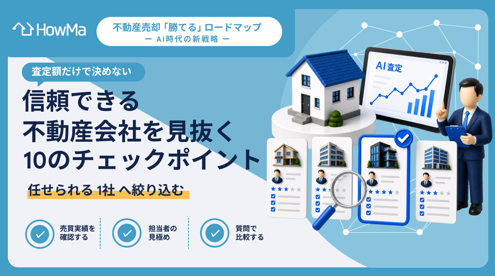
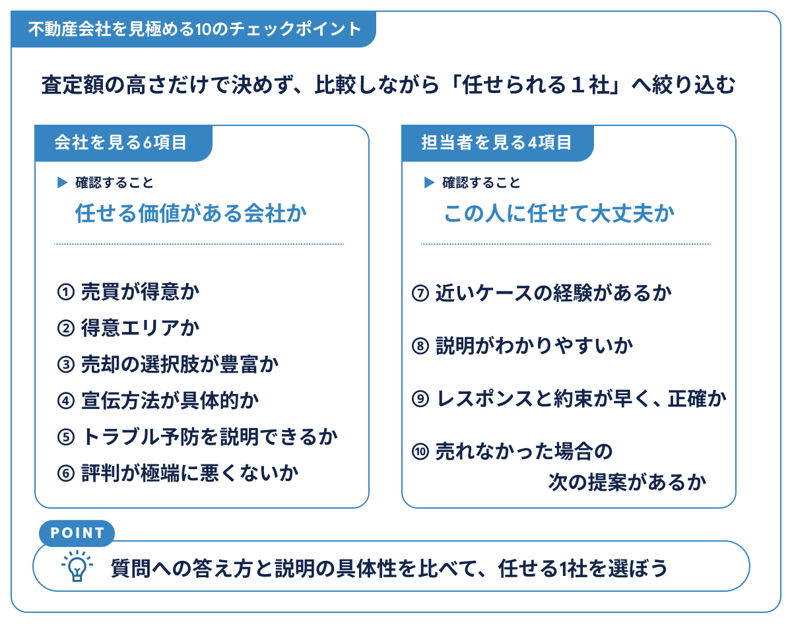

# 失敗しない！信頼できる不動産業者を見抜く10のチェックポイント

不動産会社はどこも「高く売れます」「お任せください」と言います。ホームページや営業トークを見比べても違いが分かりにくく、査定額が高い会社をそのまま信じてよいのか迷う人も多いでしょう。

たとえば、「高い査定額を出してくれた会社を選べばいいのか」「大手と地域密着型ではどちらが合うのか」「担当者を本当に信頼してよいのか」など、比べるポイントはいくつもあります。口コミや知名度だけでは判断しきれず、面談で何を確認すればよいのか分からないこともあるはずです。

ただ、**査定額の高さだけで会社を選んでしまうと**、あとから「説明が少ない」「動きが見えない」「この担当者に相談しにくい」と感じることがあります。媒介契約を結ぶ前に、何を質問し、どこを見ればよいかという判断軸を持っておくことが大切です。

この記事では、会社を見る6つのチェックポイントと、担当者を見る4つのチェックポイントを、質問例や注意したい反応とあわせて見ていきます。[Step6-1「自宅の売却を依頼する不動産会社選びの3つのステップ」](https://www.how-ma.com/mag/sell/ai-sell-realestate-perfectguide-6_1/)で候補を絞ったあと、訪問査定や面談で比較し、最後に納得して判断するためのチェックリストとして使ってください。

<mark style="background-color: #ffcccc;">CTA</mark>

## H2：まず会社を見る 「任せる価値があるか」6つのチェックポイント

不動産会社を選ぶときは、担当者との相性も大切です。その前に、**「会社として、あなたの物件を売る力があるか」**を確認しておく必要があります。

査定額が高い、名前を知っている、店舗が近いといった理由だけでは、売却を任せる判断材料としてはまだ不十分です。売買の実績や得意エリア、売却方法の選択肢、宣伝の具体性などを分けて見ることで、その会社に任せる価値があるかを見極めやすくなります。

### H3：チェック1 その会社は「売買」が得意か

まず確認したいのは、その会社が「売買」を得意としているかです。

不動産会社といっても、賃貸仲介が中心の会社、管理業務が中心の会社、売買仲介に強い会社など、得意分野はさまざまです。自宅を売りたいなら、**売買仲介の実績がある会社**に相談するほうが話は進めやすくなります。

見るポイントは、ホームページや店頭で売買物件の取り扱いがどれくらいあるかです。戸建て、マンション、土地など、自分の物件種別に近い売却実績があるかも確認しましょう。住み替え、相続、離婚など、自分に近い売却事情の事例が載っていれば、さらに相談しやすい会社と考えられます。

▼ 面談で聞くこと

- **「このエリアで、私と近い条件の売却をどれくらい担当されていますか？」**

実績の分野や得意な物件タイプを物件種別まで踏み込んで話せるなら、売却の相談先として検討しやすいでしょう。ただし、「何でもやっています」と広く言うだけで、売買実績の中身が見えない場合は、もう少し詳しく確認したいところです。

### H3：チェック2 自分の家が「得意エリア」に入っているか

次に見るべきなのは、あなたの家がその会社の得意エリアに入っているかです。

「全国対応」「都内全域対応」といった言葉だけでは、実際に**その地域で売れる感覚を持っているか**までは分かりません。同じ市区町村でも、駅距離、学区、道路付け、周辺環境によって買主の反応は変わります。

▼ 面談で聞くこと

- **「この駅周辺で最近どんな物件を、どれくらいの期間で売りましたか？」**

似た事例の価格帯、反響、販売期間が自然に出てくる会社は、エリアの動きをつかんでいる可能性があります。逆に、「広く対応しています」「詳しくは調べておきます」だけで終わる場合は、その場では得意エリアかどうかを見極めにくいでしょう。

もちろん、すべての情報を即答できなければ悪い会社というわけではありません。近隣の売却事例や買主の動きについて、どれだけ具体的に話せるかが重要な判断材料になります。

### H3：チェック3 売却の選択肢をどこまで持っているか

売却方法は、**仲介だけとは限りません**。状況によっては、買取、提携先による買取、リースバック、賃貸化、住み替え支援など、複数の選択肢を比べたほうがよい場合もあります。

たとえば、できるだけ高く売りたいなら仲介が基本になります。早く現金化したい、売却時期を確定させたい、住み替えのタイミングを合わせたいといった事情がある場合は、買取や住み替え支援の説明も聞いておくと比較しやすくなります。ただし、買取は早く進めやすい反面、仲介より価格が低くなることもあるため、メリットだけで判断しないようにしましょう。

> 関連記事：[「仲介」と「買取」の違いについて教えて-HowMa不動産売却なんでも相談室 vol.24-](https://www.how-ma.com/mag/sell/consultationroom-24/)

▼ 面談で聞くこと

- **「仲介で売れなかった場合、ほかにどんな選択肢がありますか？」**

仲介、買取、賃貸化などのメリットとデメリットを分けて説明してくれるなら、売主の事情に合わせて考えてくれる会社といえます。こちらの事情を聞かずに仲介一本で押し切る場合は、選択肢を十分に比較できないまま進んでしまう可能性があります。

また、写真撮影、片付け、軽微な修繕、引越しなど、売却に必要な周辺サービスを紹介できるかも見ておきたいポイントです。

### H3：チェック4 どんな媒体で、どう宣伝してくれる会社か

「ネットに載せます」という説明だけでは、販売戦略としてはまだ不十分です。大切なのは、あなたの物件をどんな買い手に、どんな見せ方で届けるつもりなのかです。

確認したいのは、どのポータルサイトに掲載するかだけではありません。写真をどう撮るのか、間取りや紹介文で何を強調するのか、自社顧客への紹介や店頭掲示、チラシなどネット以外の動きがあるのかも聞いておきましょう。

▼ 面談で聞くこと

- **「この物件なら、どの買い手を想定して、どんな見せ方をしますか？」**

想定買主と訴求ポイントがつながっている会社は、売り方を具体的に考えている可能性があります。たとえば、ファミリー向けなら学区や生活利便性、投資家向けなら賃料や利回りの見せ方など、買い手によって強調すべき点は変わります。

媒体名だけを並べる説明よりも、**「誰に、何を、どう見せるか」**まで話せるかを確認しましょう。

### H3：チェック5 売却後のトラブル予防や説明体制があるか

不動産売却は、売買契約を結んで終わりではありません。引き渡し後に設備や建物の状態をめぐってトラブルになる可能性もあるため、事前にどのような説明や準備が必要かを教えてくれる会社だと安心です。

ここで見たいのは、保証制度を何でも付けてくれるかではなく、**売主に必要な注意点を分かりやすく説明できるか**です。

たとえば、契約不適合責任についてどのような点に注意すべきか、建物状況調査（インスペクション）や既存住宅売買瑕疵保険を活用できる余地があるかなどを、物件の状態に合わせて説明してくれるかを確認しましょう。保険や調査は物件や契約内容によって使える条件が変わるため、「必ず付けられるか」ではなく「活用できる可能性を説明してくれるか」を見るのが現実的です。

> 関連記事：[不動産売買における契約不適合責任ってなに？](https://www.how-ma.com/mag/sell/defect-kashitanpo/)  
> 関連記事：[既存住宅インスペクションって？](https://www.how-ma.com/mag/sell/kizon-inspection/)

▼ 面談で聞くこと

- **「売却後のトラブルを減らすために、事前にできることはありますか？」**

使える制度と使えない制度を分けて説明し、必要に応じた予防策を提案してくれるなら安心材料になります。「売ったあとは関係ありません」と切り離すような反応なら、契約前にもう少し慎重に考えたほうがよいでしょう。

### H3：チェック6 評判が極端に悪くないか

口コミやSNSの評判も、補助材料として確認しておきましょう。ただし、口コミは完璧な会社を探すためのものではありません。見るべきなのは、**同じような不満が繰り返されていないか**です。

たとえば、「連絡が遅い」「説明がない」「態度が強引」「約束を守らない」といった声が複数見られる場合は注意が必要です。一方、古い口コミで悪い評価があっても、直近1〜2年で改善しているように見えるなら、現在の状況とは分けて考えてよいでしょう。

口コミを見るときは、星の数だけで判断しないことも大切です。評価が高くても内容が薄い場合もありますし、評価が低くても個別事情による不満の可能性もあります。複数の口コミを見て、同じ傾向があるかを確認しましょう。

## H2：次に担当者を見る 「この人に任せて大丈夫か」4つのチェックポイント

会社として信頼できそうでも、**実際に売却活動を進めるのは担当者です**。査定額や会社の実績に納得していても、担当者の説明が分かりにくかったり、連絡が遅かったりすると、売却中の不安は大きくなります。

担当者を見るときは、**「感じがよいか」だけで判断しない**ことが大切です。あなたのケースに近い経験があるか、質問に分かりやすく答えてくれるか、レスポンスや約束が正確か、売れなかった場合の次の提案まで話せるかを分けて確認しましょう。

### H3：チェック7 あなたのケースに近い経験と知識を持っているか

担当者の経験を見るときは、件数の多さだけで判断しないほうがよいでしょう。大切なのは、**あなたの物件や売却理由に近いケース**を扱ったことがあるかです。

たとえば、相続した実家を売る場合、住み替えで自宅を売る場合、離婚に伴って売却する場合では、注意点や進め方が変わります。マンション、戸建て、土地といった物件種別によっても、確認すべきポイントは異なります。

▼ 面談で聞くこと

- **「私と近いケースの売却を担当したことはありますか？」**

近い事例で起きやすい注意点や、そのときにどう進めたかまで話せる担当者は、実務のイメージを持っている可能性があります。件数だけを強調して中身の説明がない場合は、あなたのケースに本当に合っているかを追加で確認したいところです。

### H3：チェック8 コミュニケーションが分かりやすく双方向か

不動産売却では、専門用語や契約の話が多く出てきます。だからこそ、担当者が売主に分かる言葉で説明し、**こちらの疑問を置き去りにしないか**は重要です。

一方的に話すだけでなく、あなたの事情や希望を聞いたうえで提案してくれるかも見ておきましょう。売却希望時期、住み替えの予定、残債の有無、家族の意向などによって、現実的な売り方は変わるからです。

▼ 面談で聞くこと

- **「この査定額になった理由を、成約事例も含めて教えてください」**

良い担当者は、査定価格の根拠を近い条件の成約事例や市場の動きとあわせて説明してくれます。こちらが不安に感じている点を伝えたときに、言葉を変えたり、資料を示したりして理解を助けてくれるかも大切です。

説明が抽象的だったり、質問すると不機嫌になったりする場合は、売却活動が始まってからも相談しにくさが残るかもしれません。

### H3：チェック9 レスポンスと約束の守り方が早くて正確か

レスポンスの速さや約束を守る姿勢は、担当者を見極めるうえで分かりやすいポイントです。

初回問い合わせへの返信が早いか、査定書の送付日を守るか、訪問日時の調整がスムーズか。こうした基本的なやり取りには、売却活動が始まってからの対応姿勢が表れやすいものです。

ただし、面談前の段階では、広告出稿やレインズ登録、内覧調整が実際に早いかまではまだ分かりません。そのため、**契約後にどのような流れで動く予定なのか**を確認しておくと、任せたあとの動きが見えやすくなります。

▼ 面談で聞くこと

- **「契約した場合、最初の1〜2週間はどんな流れで動きますか？」**

販売開始、広告掲載、レインズ登録、報告頻度などを時系列で説明できる担当者なら、契約後の動きもイメージしやすくなります。レインズは媒介契約の種類によって登録義務や期限が異なるため、「いつ登録する予定か」「登録後にどう確認できるか」まで聞いておくと安心です。返事が遅いだけでなく、期限や流れを曖昧にする場合は注意しましょう。

> 関連記事：[なぜ未公開物件が生まれるのか？](https://www.how-ma.com/mag/special/why-mikoukai/)  
> 関連記事：[空室に悩んだ投資用マンションが20万の値引き・2週間で売却できた理由は？](https://www.how-ma.com/mag/sell/completion-of-sale-interview-1/)

### H3：チェック10 不安に向き合い、「売れなかったら？」まで話せるか

最後に確認したいのは、**うまくいかなかった場合の話までできるか**です。

売却活動では、売り出してすぐに反響が出ることもあれば、問い合わせや内覧が思ったより少ないこともあります。良い担当者ほど、「大丈夫です」と安心させるだけでなく、反響が弱いときに何を見直すかまで話してくれます。

▼ 面談で聞くこと

- **「1カ月売れなかったら、どこを見直しますか？」**
- **「反響が少ないときの次のプランはありますか？」**

閲覧数、問い合わせ数、内覧数などの見方を説明したうえで、価格、写真、紹介文、掲載媒体、販売方法、場合によっては買取などの選択肢を話せるなら、売却が長引いたときも相談しやすいでしょう。

> 関連記事：[2025年12月更新｜家がなかなか売れないとき…売出し価格変更のタイミングやポイント](https://www.how-ma.com/mag/sell/price-change/)

「大丈夫です」「そのとき考えます」だけで終わる場合は、少し不安が残ります。不安を伝えたときに話題を変えたり、「今決めないと損します」と急かしたりする担当者にも注意が必要です。

## まとめ：質問への答え方を比べて、任せる1社を選ぼう

ここまで、信頼できる不動産会社や担当者を見極めるためのチェックポイントを見てきました。

最後に、面談で確認したい視点をまとめます。

- 査定額の高さだけで選ばず、売却を任せたあとの動きまで見ておく
- 会社については、実績、エリア理解、選択肢、宣伝方法、トラブル予防、評判を分けて確認する
- 担当者については、経験の中身、説明の分かりやすさ、連絡の正確さ、売れなかった場合の提案力を見る
- 10項目すべてに完璧な答えがなくても、質問への向き合い方を比べると違いが見えてくる
- 最後は、会社・担当者・売り方の考え方を総合して「この会社なら任せられる」と納得できるかで選ぶ

[Step6-1「自宅の売却を依頼する不動産会社選びの3つのステップ」](https://www.how-ma.com/mag/sell/ai-sell-realestate-perfectguide-6_1/)で複数社を比較し、本命候補を絞ったら、訪問査定や面談でこの10項目を確認してみてください。「この会社なら任せられる」と納得して選ぶための判断材料になります。

不動産会社選びでは、最初から完璧な1社を見つけようとするより、相場感を持ったうえで複数社の提案を比べることが大切です。まずはAI査定で自宅の価格の目安を確認し、複数社の説明や提案を見比べながら、自分の物件に合う会社と担当者を見極めていきましょう。

<mark style="background-color: #ffcccc;">CTA</mark>
